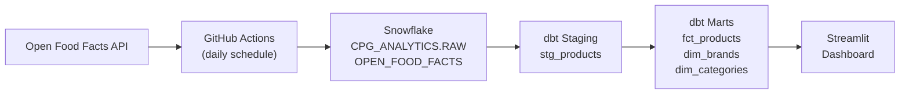
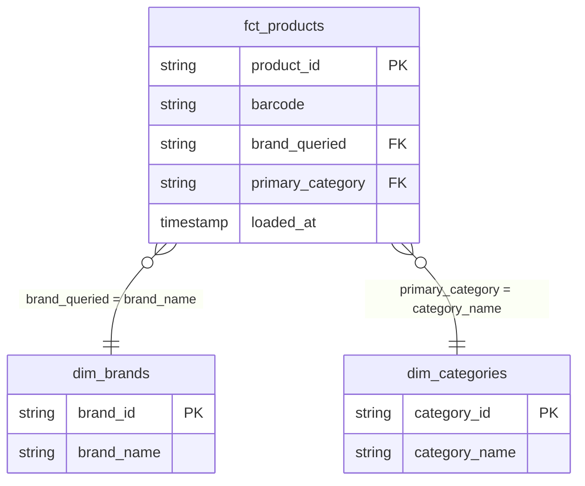

# CPG Analytics — ZURU

End-to-end CPG analytics pipeline built to demonstrate Data Analyst Intern skills at ZURU. Ingests Open Food Facts product data into Snowflake, transforms via a dbt star schema across ZURU Edge's five verticals, and surfaces category intelligence through a Streamlit dashboard.

**Live dashboard:** https://cpg-analytics-zuru.streamlit.app/

[](https://github.com/clkandrade-star/cpg-analytics-zuru/actions/workflows/extract.yml)

## Dashboard

The dashboard surfaces competitive product intelligence across ZURU's five CPG verticals:

- **KPI cards** — total products, distinct brands, categories, and ZURU product count with day-over-day deltas
- **Market concentration scorecard** — top-3 brand share % per vertical. Lower % = more fragmented market = higher disruption opportunity for ZURU.
- **Top 5 Brands by Vertical** — faceted bar chart, filterable by vertical and date range

## Pipeline




## Star Schema



## Stack

| Layer | Tool |
|---|---|
| Extraction | Python (`src/extract_off.py`, `src/extract_zuru.py`) |
| Orchestration | GitHub Actions |
| Data Warehouse | Snowflake (AWS US East 1) |
| Transformation | dbt |
| Dashboard | Streamlit Community Cloud |
| Knowledge Base | Firecrawl + Claude Code |

## Verticals

ZURU Edge's five CPG categories: pet care · baby care · personal care/beauty · home care · health & wellness

## Quick Start

```bash
git clone https://github.com/clkandrade-star/cpg-analytics-zuru.git
cd cpg-analytics-zuru
pip install -r src/requirements.txt
cp .env.example .env        # fill in Snowflake + Firecrawl credentials
python src/extract_off.py   # load ~2,500 products into Snowflake
cd dbt && dbt run && dbt test
cd .. && streamlit run streamlit_app.py
```

See [SETUP.md](SETUP.md) for full setup instructions, including Snowflake prerequisites and dbt profile configuration.

## Documentation

| Doc | Purpose |
|---|---|
| [SETUP.md](SETUP.md) | Full local development setup |
| [ARCHITECTURE.md](ARCHITECTURE.md) | Pipeline design and decisions |
| [TESTING.md](TESTING.md) | Running unit tests and dbt tests |
| [DEPLOYMENT.md](DEPLOYMENT.md) | Streamlit Cloud and GitHub Actions |
| [TROUBLESHOOTING.md](TROUBLESHOOTING.md) | Common errors and fixes |
| [CONTRIBUTING.md](CONTRIBUTING.md) | Branch strategy and coding standards |
| [SECURITY.md](SECURITY.md) | Secrets management and data sensitivity |
| [CHANGELOG.md](CHANGELOG.md) | Version history |
