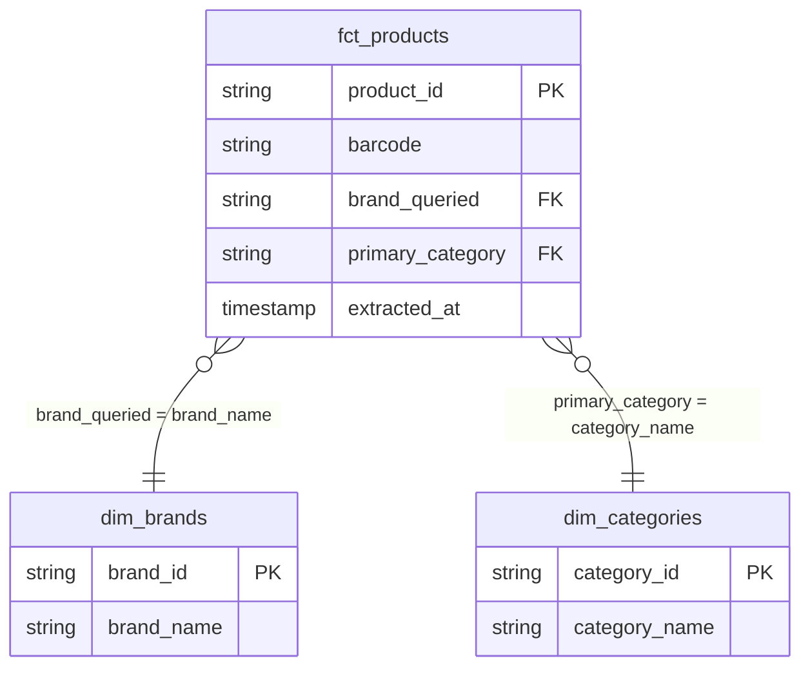

# CPG Analytics — ZURU

End-to-end CPG analytics pipeline built to demonstrate Data Analyst Intern skills at ZURU. Ingests Open Food Facts product data into Snowflake, transforms via a dbt star schema across ZURU Edge's five verticals, and surfaces category intelligence through a Streamlit dashboard.

## Pipeline


## Star Schema



## Stack

| Layer | Tool |
|---|---|
| Extraction | Python (`src/extract_off.py`, `src/extract_zuru.py`) |
| Orchestration | GitHub Actions |
| Data Warehouse | Snowflake (AWS US East 1) |
| Transformation | dbt |
| Dashboard | Streamlit Community Cloud |
| Knowledge Base | Firecrawl + Claude Code |

## Verticals

ZURU Edge's five CPG categories: pet care · baby care · personal care/beauty · home care · health & wellness

## Setup

```bash
pip install -r src/requirements.txt
cp .env.example .env  # fill in Snowflake + Firecrawl credentials
python src/extract_off.py
python src/extract_zuru.py
```

See `.env.example` for required environment variables.
