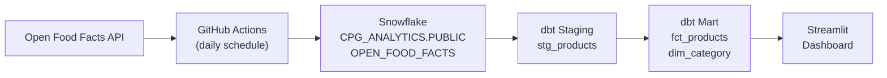
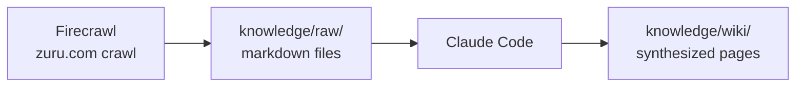
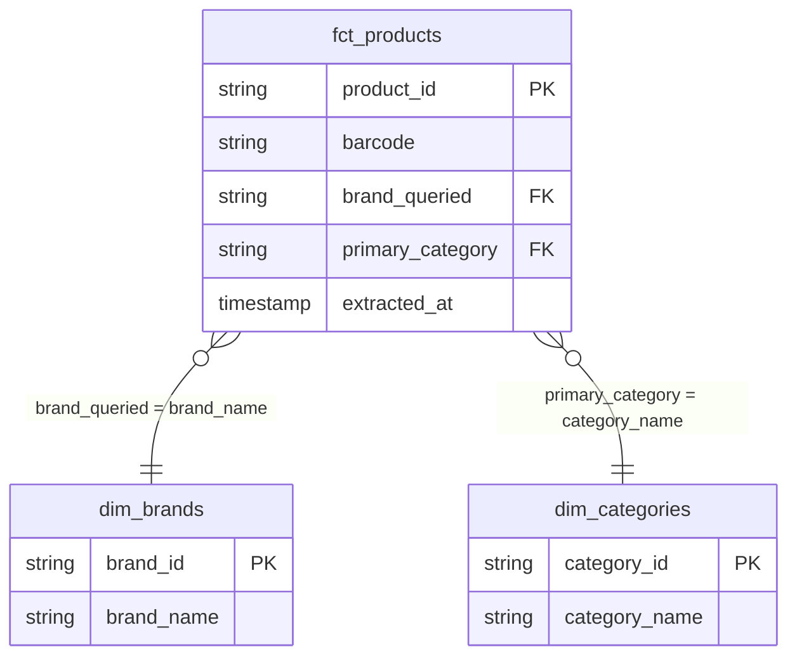

# Project Documentation Implementation Plan

> **For agentic workers:** REQUIRED SUB-SKILL: Use superpowers:subagent-driven-development (recommended) or superpowers:executing-plans to implement this plan task-by-task. Steps use checkbox (`- [ ]`) syntax for tracking.

**Goal:** Create all missing project documentation so any collaborator can clone, run, test, and deploy the CPG Analytics pipeline without prior knowledge.

**Architecture:** 11 files across root, dbt/, and updated README. All files are independent — tasks can be parallelized. No code changes; documentation only.

**Tech Stack:** Markdown, Makefile, MIT License

---

## File Structure

| File | Status | Purpose |
|---|---|---|
| `SETUP.md` | Create | Full local dev setup (venv, Snowflake, dbt, Firecrawl) |
| `CONTRIBUTING.md` | Create | Branch strategy, PR process, coding standards |
| `ARCHITECTURE.md` | Create | Pipeline design decisions, star schema rationale |
| `TESTING.md` | Create | How to run pytest + dbt tests, test strategy |
| `DEPLOYMENT.md` | Create | Streamlit Cloud + GitHub Actions secrets setup |
| `TROUBLESHOOTING.md` | Create | Common errors and debugging guidance |
| `SECURITY.md` | Create | Secret management, data sensitivity |
| `CHANGELOG.md` | Create | Version history starting at v1.0.0 |
| `LICENSE` | Create | MIT license |
| `Makefile` | Create | make setup / test / extract / dbt-run / dbt-test / docs |
| `README.md` | Update | Add live URL, badge, dashboard description, link to SETUP.md |

---

## Task 1: SETUP.md

**Files:**
- Create: `SETUP.md`

- [ ] **Step 1: Create SETUP.md**

```markdown
# Setup Guide

## Prerequisites

- Python 3.11+
- A Snowflake account (free trial at snowflake.com)
- A Firecrawl API key (free tier at app.firecrawl.dev) — only needed to re-run the ZURU web scrape

## 1. Clone and create a virtual environment

```bash
git clone https://github.com/clkandrade-star/cpg-analytics-zuru.git
cd cpg-analytics-zuru
python -m venv .venv
source .venv/bin/activate        # Windows: .venv\Scripts\activate
pip install -r src/requirements.txt
```

## 2. Configure environment variables

```bash
cp .env.example .env
```

Open `.env` and fill in your values:

| Variable | Where to find it |
|---|---|
| `SNOWFLAKE_ACCOUNT` | Your Snowflake URL: `<account>.snowflakecomputing.com` |
| `SNOWFLAKE_USER` | Your Snowflake username |
| `SNOWFLAKE_PASSWORD` | Your Snowflake password |
| `SNOWFLAKE_WAREHOUSE` | Name of your warehouse (default: `COMPUTE_WH`) |
| `SNOWFLAKE_ROLE` | Role with CREATE DATABASE privileges (default: `SYSADMIN`) |
| `FIRECRAWL_API_KEY` | From app.firecrawl.dev — only needed for `extract_zuru.py` |

## 3. Snowflake prerequisites

The extraction script auto-creates the database and schema on first run. Your Snowflake role must have:

```sql
-- Run once in Snowflake as ACCOUNTADMIN if SYSADMIN lacks these
GRANT CREATE DATABASE ON ACCOUNT TO ROLE SYSADMIN;
GRANT USAGE ON WAREHOUSE COMPUTE_WH TO ROLE SYSADMIN;
```

## 4. Run the extraction

```bash
python src/extract_off.py     # loads ~2,500 rows from Open Food Facts
python src/extract_zuru.py    # scrapes zuru.com (requires FIRECRAWL_API_KEY)
```

This creates `CPG_ANALYTICS.RAW.OPEN_FOOD_FACTS` in Snowflake.

## 5. Set up dbt

```bash
pip install dbt-snowflake
cp dbt/profiles.yml.example ~/.dbt/profiles.yml
```

The example profile reads from the same environment variables as the extraction scripts, so no additional config is needed if your `.env` is already set.

```bash
cd dbt
dbt deps        # install dbt packages (none currently, but good habit)
dbt debug       # verify connection to Snowflake
dbt run         # build staging + mart models
dbt test        # run schema tests
```

This creates `CPG_ANALYTICS.DBT_CANDRADE.{fct_products, dim_brands, dim_categories}`.

## 6. Run the dashboard locally

```bash
cd ..           # back to repo root
streamlit run streamlit_app.py
```

Open http://localhost:8501 in your browser.

## 7. Run the test suite

```bash
pytest tests/ -v
```

See [TESTING.md](TESTING.md) for details.
```

- [ ] **Step 2: Verify the file exists**

```bash
ls -la SETUP.md
```

---

## Task 2: CONTRIBUTING.md

**Files:**
- Create: `CONTRIBUTING.md`

- [ ] **Step 1: Create CONTRIBUTING.md**

```markdown
# Contributing

## Branch Strategy

- `main` — always deployable. Protected; merge via PR only.
- Feature branches: `feat/<short-description>` (e.g., `feat/add-nutrition-chart`)
- Bug fixes: `fix/<short-description>`
- dbt model changes: `dbt/<short-description>`

## Making Changes

1. Create a branch from `main`
2. Make your changes (see domain-specific sections below)
3. Run tests locally: `pytest tests/ -v && cd dbt && dbt test`
4. Open a PR against `main` with a description of what changed and why

## Adding or Modifying dbt Models

- Place staging models in `dbt/models/staging/`
- Place mart models in `dbt/models/marts/`
- Every new model needs an entry in the corresponding `schema.yml` with at least one column test
- Run `dbt run && dbt test` before committing

## Modifying the Extraction Scripts

- `src/extract_off.py` — Open Food Facts pipeline. The `VERTICALS` dict maps ZURU vertical names to OFF category tags. Add a new vertical by appending to that dict.
- `src/extract_zuru.py` — ZURU website scrape via Firecrawl. Requires `FIRECRAWL_API_KEY`.
- Update `tests/test_extract_off.py` or `tests/test_extract_zuru.py` for any logic changes.

## Modifying the Dashboard

- `streamlit_app.py` contains all UI code.
- Query functions use `@st.cache_data(ttl=300)` — 5-minute cache. Adjust `ttl` for freshness vs. performance tradeoffs.
- Test dashboard logic in `tests/test_streamlit_app.py`.

## SQL Style

- Uppercase SQL keywords (`SELECT`, `FROM`, `WHERE`)
- Lowercase table and column names in dbt models
- One clause per line for multi-condition queries

## Python Style

- Follow PEP 8
- Functions should do one thing
- Use type hints for function signatures

## Commit Messages

```
type: short description (50 chars max)

Optional longer explanation.
```

Types: `feat`, `fix`, `dbt`, `docs`, `test`, `chore`
```

- [ ] **Step 2: Verify**

```bash
ls -la CONTRIBUTING.md
```

---

## Task 3: ARCHITECTURE.md

**Files:**
- Create: `ARCHITECTURE.md`

- [ ] **Step 1: Create ARCHITECTURE.md**

```markdown
# Architecture

## Pipeline Overview

```
Open Food Facts API
        │
        ▼
GitHub Actions (daily 6am UTC)
        │  src/extract_off.py
        ▼
Snowflake: CPG_ANALYTICS.RAW.OPEN_FOOD_FACTS
        │  (raw JSON stored in VARIANT column)
        ▼
dbt Staging: stg_products
        │  (parse fields from RAW_JSON, filter nulls)
        ▼
dbt Marts: fct_products + dim_brands + dim_categories
        │  (star schema, business-ready)
        ▼
Streamlit Dashboard (Streamlit Community Cloud)
```

A parallel pipeline scrapes zuru.com via Firecrawl and synthesizes competitive intelligence into `knowledge/wiki/` pages, which inform dashboard design and ZURU vertical definitions.

## Why Snowflake

Snowflake's VARIANT type stores the raw Open Food Facts JSON without schema enforcement upfront, allowing the extraction script to run without knowing which fields are populated. dbt then parses only the fields the dashboard needs. This separates the "land everything" concern from the "model what matters" concern.

## Why dbt

dbt provides SQL-based transformations with built-in testing (`not_null`, `unique`, `accepted_values`), version control, and documentation generation. The star schema is a natural fit for dashboard queries that aggregate across brands and categories.

## Star Schema Design

```
fct_products (one row per product-load)
    │── brand_queried ──→ dim_brands.brand_name
    └── primary_category ──→ dim_categories.category_name
```

`fct_products` is a snapshot table — each daily pipeline run appends rows rather than upsert. This preserves load history for day-over-day delta metrics visible in the dashboard.

`dim_brands` and `dim_categories` are derived from `fct_products` via `SELECT DISTINCT`, so they always reflect whatever brands and categories exist in the fact table.

## Vertical → Category Tag Mapping

ZURU Edge's five CPG verticals map to Open Food Facts category tags:

| ZURU Vertical | OFF Category Tag |
|---|---|
| `pet_care` | `en:pet-food` |
| `baby_care` | `en:baby-foods` |
| `personal_care` | `en:cosmetics` |
| `home_care` | `en:household-cleaning` |
| `health_wellness` | `en:dietary-supplements` |

This mapping lives in `src/extract_off.py:VERTICALS`. To add a vertical, append a new key-value pair there and add the value to the `accepted_values` test in `dbt/models/marts/schema.yml`.

## Data Quality Assumptions

- Products without a barcode (`code` field) are loaded with an empty string — the dbt staging model filters these out.
- `brand_queried` comes from `RAW_JSON:brands` (first listed brand). Products with no brand are filtered by the `not_null` test in staging.
- `primary_category` comes from `RAW_JSON:main_category`. Products without one are filtered similarly.
- Deduplication is not applied at load time. The `product_id` surrogate key (MD5 of barcode + vertical + loaded_at) ensures uniqueness per load, not per product.

## GitHub Actions Orchestration

The daily workflow (`.github/workflows/extract.yml`) runs at 6am UTC (11pm PT). It:
1. Installs `src/requirements.txt`
2. Runs `extract_off.py` (loads ~500 products per vertical, ~2,500 total)
3. Runs `extract_zuru.py` (scrapes zuru.com, updates `knowledge/raw/`)

dbt runs are not automated — run `dbt run` manually or extend the workflow.

## Dashboard Architecture

`streamlit_app.py` connects directly to Snowflake using `st.cache_resource` for the connection (persists across rerenders) and `st.cache_data(ttl=300)` for query results (5-minute cache). All SQL runs against `CPG_ANALYTICS.DBT_CANDRADE.*`.

The dashboard detects whether `loaded_at` exists in `fct_products` at startup via `detect_columns()` to handle schema evolution gracefully.
```

- [ ] **Step 2: Verify**

```bash
ls -la ARCHITECTURE.md
```

---

## Task 4: TESTING.md

**Files:**
- Create: `TESTING.md`

- [ ] **Step 1: Create TESTING.md**

```markdown
# Testing

## Running the Test Suite

```bash
# From repo root, with .venv active
pytest tests/ -v
```

Expected output: all tests pass. No Snowflake connection required — Snowflake calls are mocked.

## Test Files

| File | What it covers |
|---|---|
| `tests/test_extract_off.py` | `fetch_products()`, `build_row()`, `setup_table()` |
| `tests/test_extract_zuru.py` | ZURU Firecrawl extraction logic |
| `tests/test_streamlit_app.py` | Dashboard query functions and UI logic |

`tests/conftest.py` mocks the Streamlit session state and Snowflake connector so tests run without live credentials.

## Running a Single Test File

```bash
pytest tests/test_extract_off.py -v
```

## Running dbt Tests

dbt schema tests live in `dbt/models/marts/schema.yml` and `dbt/models/sources.yml`.

```bash
cd dbt
dbt test
```

Tests run against the live Snowflake schema (`CPG_ANALYTICS.DBT_CANDRADE`), so Snowflake credentials must be configured and `dbt run` must have been run first.

To run tests for a single model:

```bash
dbt test --select fct_products
```

## dbt Test Coverage

| Model | Tests |
|---|---|
| `fct_products` | `unique`, `not_null` on `product_id`; `not_null` on `barcode`, `brand_queried`, `primary_category`, `loaded_at`; `accepted_values` on `vertical` |
| `dim_brands` | `unique`, `not_null` on `brand_id` and `brand_name` |
| `dim_categories` | `unique`, `not_null` on `category_id` and `category_name` |

## CI

GitHub Actions currently runs only the extraction pipeline (no automated pytest or dbt test step). To add tests to CI, append to `.github/workflows/extract.yml`:

```yaml
- name: Run tests
  run: pytest tests/ -v
```
```

- [ ] **Step 2: Verify**

```bash
ls -la TESTING.md
```

---

## Task 5: DEPLOYMENT.md

**Files:**
- Create: `DEPLOYMENT.md`

- [ ] **Step 1: Create DEPLOYMENT.md**

```markdown
# Deployment

## Live Dashboard

The dashboard is deployed at **https://cpg-analytics-zuru.streamlit.app/** via Streamlit Community Cloud.

## GitHub Actions — Extraction Pipeline

The daily extraction runs automatically via `.github/workflows/extract.yml` (6am UTC). It requires these repository secrets set under **Settings → Secrets and variables → Actions**:

| Secret | Value |
|---|---|
| `SNOWFLAKE_ACCOUNT` | e.g., `myorg-myaccount` |
| `SNOWFLAKE_USER` | Your Snowflake username |
| `SNOWFLAKE_PASSWORD` | Your Snowflake password |
| `SNOWFLAKE_WAREHOUSE` | e.g., `COMPUTE_WH` |
| `SNOWFLAKE_ROLE` | e.g., `SYSADMIN` |
| `FIRECRAWL_API_KEY` | From app.firecrawl.dev |

To trigger manually: **Actions → Daily Extract → Run workflow**.

## Streamlit Community Cloud Deployment

1. Fork or push this repo to a public GitHub repository
2. Go to share.streamlit.io and sign in with GitHub
3. Click **New app** → select the repo → set **Main file path** to `streamlit_app.py`
4. Under **Advanced settings → Secrets**, paste:

```toml
SNOWFLAKE_ACCOUNT = "yourorg-youraccount"
SNOWFLAKE_USER = "your_username"
SNOWFLAKE_PASSWORD = "your_password"
SNOWFLAKE_WAREHOUSE = "COMPUTE_WH"
SNOWFLAKE_ROLE = "SYSADMIN"
```

5. Click **Deploy**. Streamlit will install `requirements.txt` from the repo root automatically.

## Promoting dbt Schema to Production

The current setup uses `DBT_CANDRADE` as both dev and prod schema. To separate them:

1. Add a `prod` output to `dbt/profiles.yml.example` pointing to a `DBT_PROD` schema
2. Set `DBT_TARGET=prod` in GitHub Actions secrets
3. Update `streamlit_app.py:SCHEMA` to read from `os.environ.get("DBT_SCHEMA", "DBT_CANDRADE")`

## Forcing a Data Refresh

To truncate the raw table before loading (e.g., after a schema change):

```bash
TRUNCATE_BEFORE_LOAD=true python src/extract_off.py
```

Or set `TRUNCATE_BEFORE_LOAD=true` as a GitHub Actions secret before triggering the workflow manually.
```

- [ ] **Step 2: Verify**

```bash
ls -la DEPLOYMENT.md
```

---

## Task 6: TROUBLESHOOTING.md

**Files:**
- Create: `TROUBLESHOOTING.md`

- [ ] **Step 1: Create TROUBLESHOOTING.md**

```markdown
# Troubleshooting

## Snowflake Connection Errors

**`250001: Failed to connect`** — Wrong `SNOWFLAKE_ACCOUNT`. Check your Snowflake URL: `https://<account>.snowflakecomputing.com`. Use only `<account>` (no `.snowflakecomputing.com`).

**`390100: IP address not allowed`** — Your IP may be blocked by a Snowflake network policy. Log in to the Snowflake UI and check **Admin → Security → Network Policies**.

**`token has expired`** — The Streamlit app uses `authenticator="snowflake"` (native password auth). If you see a token expiry error on Streamlit Community Cloud, verify the password secret is correct and re-deploy.

## dbt Errors

**`Could not find profile named 'cpg_analytics'`** — The `~/.dbt/profiles.yml` file is missing or uses the wrong profile name. Copy `dbt/profiles.yml.example` to `~/.dbt/profiles.yml`.

**`Database 'CPG_ANALYTICS' does not exist`** — Run `python src/extract_off.py` first to create the database and raw table.

**`Relation not found: CPG_ANALYTICS.DBT_CANDRADE.STG_PRODUCTS`** — Run `dbt run` before `dbt test`. Tests validate models that must already exist.

**dbt test failures on `accepted_values` for `vertical`** — A new vertical was added to `src/extract_off.py:VERTICALS` but not to `dbt/models/marts/schema.yml`. Add the new value to the `accepted_values` list.

## GitHub Actions Failures

**Workflow fails on `Run extract_off.py`** — Check that all five secrets are set under **Settings → Secrets and variables → Actions**. A missing secret silently becomes an empty string, causing an auth failure.

**503 errors from Open Food Facts API** — The script retries up to 3 times with increasing delays. If all retries fail, the vertical is skipped with a WARNING and the run continues. This is expected during OFF maintenance windows.

## Streamlit Dashboard Issues

**Blank dashboard / "Could not connect to Snowflake"** — Secrets are missing or malformed in the Streamlit Community Cloud app settings. Re-check **Advanced settings → Secrets**.

**KPI deltas showing `None`** — The raw table has fewer than two distinct load dates. Run the extraction at least twice on different days.

**`st.cache_data` serving stale data** — Cache TTL is 300 seconds (5 minutes). Force a refresh by pressing **R** in the browser or stopping/restarting the app.

## Python / pytest

**`ModuleNotFoundError: No module named 'snowflake'`** — Virtual environment not activated, or `pip install -r src/requirements.txt` not run.

**Tests failing with `ImportError` on `streamlit`** — Run `pip install -r src/requirements.txt`, which includes streamlit.
```

- [ ] **Step 2: Verify**

```bash
ls -la TROUBLESHOOTING.md
```

---

## Task 7: SECURITY.md

**Files:**
- Create: `SECURITY.md`

- [ ] **Step 1: Create SECURITY.md**

```markdown
# Security

## Secrets Management

All credentials are passed via environment variables. **Never commit secrets to git.**

Files that must never be committed (already in `.gitignore`):
- `.env`
- `dbt/profiles.yml`
- Any file containing API keys, passwords, or account identifiers

Use `.env.example` and `dbt/profiles.yml.example` as templates. These contain only placeholder values.

For GitHub Actions, secrets are stored under **Settings → Secrets and variables → Actions** and injected at runtime.

For Streamlit Community Cloud, secrets are stored in **Advanced settings → Secrets** (TOML format) and are never logged or exposed.

## Data Sensitivity

This project processes only publicly available product data from Open Food Facts (openfoodfacts.org). No personally identifiable information (PII) is collected, stored, or processed.

The ZURU website scrape (`src/extract_zuru.py`) collects only publicly visible marketing and product content.

## Reporting Vulnerabilities

If you discover a credential accidentally committed to this repository, rotate it immediately:
1. Change the password/key in the originating service
2. Remove it from git history using `git filter-repo` or BFG Repo Cleaner
3. Force-push the cleaned history and notify any collaborators
```

- [ ] **Step 2: Verify**

```bash
ls -la SECURITY.md
```

---

## Task 8: CHANGELOG.md

**Files:**
- Create: `CHANGELOG.md`

- [ ] **Step 1: Create CHANGELOG.md**

```markdown
# Changelog

All notable changes to this project are documented here.
Format follows [Keep a Changelog](https://keepachangelog.com/en/1.0.0/).

## [1.0.0] — 2026-04-30

### Added
- Open Food Facts extraction pipeline (`src/extract_off.py`) covering five ZURU CPG verticals
- ZURU website scrape via Firecrawl (`src/extract_zuru.py`)
- Snowflake raw layer: `CPG_ANALYTICS.RAW.OPEN_FOOD_FACTS` with VARIANT JSON storage
- dbt star schema: `fct_products`, `dim_brands`, `dim_categories` with schema tests
- Streamlit dashboard with KPI cards, market concentration scorecard, and top-5 brands chart
- Knowledge base: Firecrawl-scraped ZURU content synthesized into `knowledge/wiki/` pages
- GitHub Actions daily extraction workflow (6am UTC)
- Streamlit Community Cloud deployment at https://cpg-analytics-zuru.streamlit.app/
- Day-over-day KPI deltas from raw load history
- Vertical filter sidebar and date range filter
- Devcontainer configuration for VS Code
```

- [ ] **Step 2: Verify**

```bash
ls -la CHANGELOG.md
```

---

## Task 9: LICENSE

**Files:**
- Create: `LICENSE`

- [ ] **Step 1: Create LICENSE**

```
MIT License

Copyright (c) 2026 clkandrade

Permission is hereby granted, free of charge, to any person obtaining a copy
of this software and associated documentation files (the "Software"), to deal
in the Software without restriction, including without limitation the rights
to use, copy, modify, merge, publish, distribute, sublicense, and/or sell
copies of the Software, and to permit persons to whom the Software is
furnished to do so, subject to the following conditions:

The above copyright notice and this permission notice shall be included in all
copies or substantial portions of the Software.

THE SOFTWARE IS PROVIDED "AS IS", WITHOUT WARRANTY OF ANY KIND, EXPRESS OR
IMPLIED, INCLUDING BUT NOT LIMITED TO THE WARRANTIES OF MERCHANTABILITY,
FITNESS FOR A PARTICULAR PURPOSE AND NONINFRINGEMENT. IN NO EVENT SHALL THE
AUTHORS OR COPYRIGHT HOLDERS BE LIABLE FOR ANY CLAIM, DAMAGES OR OTHER
LIABILITY, WHETHER IN AN ACTION OF CONTRACT, TORT OR OTHERWISE, ARISING FROM,
OUT OF OR IN CONNECTION WITH THE SOFTWARE OR THE USE OR OTHER DEALINGS IN THE
SOFTWARE.
```

- [ ] **Step 2: Verify**

```bash
ls -la LICENSE
```

---

## Task 10: Makefile

**Files:**
- Create: `Makefile`

- [ ] **Step 1: Create Makefile**

```makefile
.PHONY: setup test extract dbt-run dbt-test dbt-docs lint

setup:
	python -m venv .venv
	.venv/bin/pip install -r src/requirements.txt
	@echo "Run: source .venv/bin/activate"

test:
	pytest tests/ -v

extract:
	python src/extract_off.py
	python src/extract_zuru.py

dbt-run:
	cd dbt && dbt run

dbt-test:
	cd dbt && dbt test

dbt-docs:
	cd dbt && dbt docs generate && dbt docs serve

dashboard:
	streamlit run streamlit_app.py

lint:
	ruff check src/ tests/ streamlit_app.py
```

- [ ] **Step 2: Verify**

```bash
ls -la Makefile
```

---

## Task 11: Update README.md

**Files:**
- Modify: `README.md`

- [ ] **Step 1: Rewrite README.md with live URL, badge, dashboard description, and links**

Replace the entire file with:

```markdown
# CPG Analytics — ZURU

End-to-end CPG analytics pipeline built to demonstrate Data Analyst Intern skills at ZURU. Ingests Open Food Facts product data into Snowflake, transforms via a dbt star schema across ZURU Edge's five verticals, and surfaces category intelligence through a Streamlit dashboard.

**Live dashboard:** https://cpg-analytics-zuru.streamlit.app/

[](https://github.com/clkandrade-star/cpg-analytics-zuru/actions/workflows/extract.yml)

## Dashboard

The dashboard shows:
- **KPI cards** — total products, brands, categories, and ZURU product count with day-over-day deltas
- **Market concentration scorecard** — top-3 brand share % per vertical (lower % = more fragmented = higher disruption opportunity)
- **Top 5 Brands by Vertical** — faceted bar chart filterable by vertical and date range

## Pipeline





## Star Schema



## Stack

| Layer | Tool |
|---|---|
| Extraction | Python (`src/extract_off.py`, `src/extract_zuru.py`) |
| Orchestration | GitHub Actions |
| Data Warehouse | Snowflake (AWS US East 1) |
| Transformation | dbt |
| Dashboard | Streamlit Community Cloud |
| Knowledge Base | Firecrawl + Claude Code |

## Verticals

ZURU Edge's five CPG categories: pet care · baby care · personal care/beauty · home care · health & wellness

## Quick Start

```bash
pip install -r src/requirements.txt
cp .env.example .env  # fill in credentials
python src/extract_off.py
cd dbt && dbt run && dbt test
streamlit run streamlit_app.py
```

See [SETUP.md](SETUP.md) for full setup instructions including Snowflake prerequisites and dbt profile configuration.

## Docs

- [SETUP.md](SETUP.md) — full local development setup
- [ARCHITECTURE.md](ARCHITECTURE.md) — pipeline design and decisions
- [TESTING.md](TESTING.md) — running tests
- [DEPLOYMENT.md](DEPLOYMENT.md) — Streamlit Cloud and GitHub Actions
- [TROUBLESHOOTING.md](TROUBLESHOOTING.md) — common errors
- [CONTRIBUTING.md](CONTRIBUTING.md) — how to contribute
```

- [ ] **Step 2: Verify**

```bash
ls -la README.md
```

---

## Self-Review

**Spec coverage check:**
- SETUP.md ✓ — covers venv, env vars, Snowflake prerequisites, dbt, dashboard, tests
- CONTRIBUTING.md ✓ — branch strategy, PR process, dbt/extraction/dashboard guidance, SQL/Python style, commit messages
- ARCHITECTURE.md ✓ — pipeline flow, Snowflake/dbt rationale, star schema design, vertical mapping, data quality assumptions, GH Actions, dashboard caching
- TESTING.md ✓ — pytest, dbt test, CI gap documented
- DEPLOYMENT.md ✓ — GH Actions secrets, Streamlit Cloud, dbt schema promotion, force refresh
- TROUBLESHOOTING.md ✓ — Snowflake connection, dbt errors, GH Actions failures, dashboard issues, pytest
- SECURITY.md ✓ — secrets management, data sensitivity, PII statement, incident response
- CHANGELOG.md ✓ — v1.0.0 with all shipped features
- LICENSE ✓ — MIT
- Makefile ✓ — setup, test, extract, dbt-run, dbt-test, dbt-docs, dashboard, lint
- README.md ✓ — live URL, badge, dashboard description, quick start, doc links

**Placeholder scan:** No TBD, TODO, or vague references found.

**Type consistency:** N/A (documentation only).
